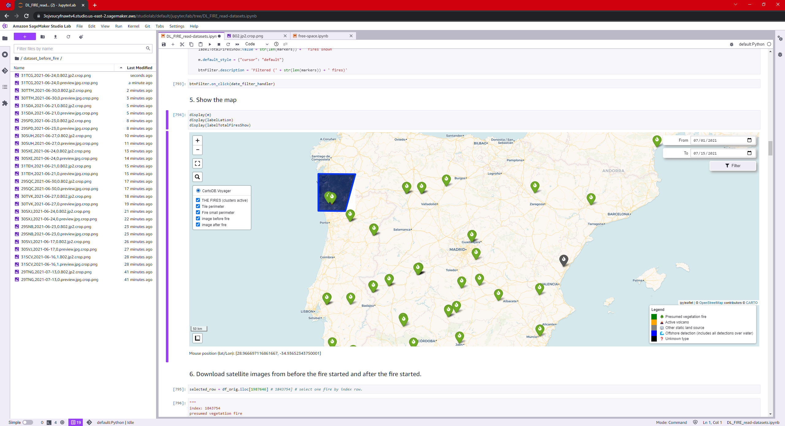

# 🔥 Wildfire Prediction

A POC to **predict potential wildfire-prone areas** using satellite images taken *before* fire outbreaks.

## 🌍 Inspiration

As an aspiring contributor to GSoC 2025, I explored the Science and Medicine category and found the Alaska organization, which deeply resonated with my passion for sustainable energy and environmental resilience. Alaska faces unique wildfire challenges, with large-scale fires occurring annually in its boreal forests, tundra, and remote wilderness. Predicting fire-prone areas in such regions is vital for disaster mitigation and efficient resource allocation. While vegetation acts as fuel, key fire triggers include weather conditions (humidity, wind speed, temperature) and ignition sources (like lightning or human activity). Traditional wildfire prediction methods often rely on historical data and human observation, which can be delayed or inaccurate in remote terrains. This project aims to develop a hybrid deep learning model that leverages optical, thermal, and SAR (Synthetic Aperture Radar) satellite imagery, combined with ground-based weather data, to deliver timely and accurate wildfire risk predictions. Satellite data provides real-time insights into vegetation health, thermal anomalies, fuel dryness, and burn severity—even in cloud-covered or inaccessible regions—making it a powerful alternative to conventional approaches.

---

## 📊 Step 1: Data Collection

- **MODIS FIRMS**: Fire locations dataset (300-500m resolution)  
  📥 

- **Sentinel-2 Satellite**: High-resolution imagery (10m resolution, updated every 5 days)  
  🌐 [Access via AWS Open Data](https://registry.opendata.aws/sentinel-2/)
  

---

## 🧹 Step 2: Data Preparation

1. **Explore data** using an interactive map with:
   - Date filters
   - Layer selection
   - Popups for metadata

2. **Download & crop satellite images** taken *before* each fire event.
   - Automated processing at scale.

3. **Overlay fire locations** on corresponding satellite images.

4. **Convert images to grayscale** for simplified model input.

5. **Label data**:
   - “Future fire” (images prior to known fire)
   - “Non-fireable” (images from safe regions)
   
   

---

## 🧠 Step 3: Train the Model

- **Model**: Visual Transformer (ViT)
- **Task**: Binary classification  
  ➤ “Potential place for future fire” vs “No future fire”

---

## 📈 Step 4: Evaluation & Prediction

Three prediction interfaces:
1. 🌐 **URL Input** – Paste a link to a satellite image.
2. 📂 **Image Upload** – Upload your own image file.

3. 🗺️ **Map Click** – Choose a point using Latitude/Longitude.

---

## 🚀 Usage

Coming soon: Web app or CLI interface for real-time wildfire risk prediction.

---

Here's the **Future Work** section with bullet points converted into **checkbox format**, matching your README style:

---

### Future Work

While this project currently detects wildfire burn scars using a U-Net model, several enhancements are planned to shift toward predictive capabilities—especially for fire-prone regions like Alaska:

- [ ] **Integrate multimodal satellite data** (optical, thermal, SAR) to improve prediction accuracy in various weather and visibility conditions.  
- [ ] **Fuse ground-based environmental data** such as temperature, humidity, wind speed, and lightning activity to enrich the fire risk model.  
- [ ] **Develop temporal prediction models** that use pre-fire satellite imagery to anticipate high-risk ignition zones.  
- [ ] **Create high-resolution risk maps** using Sentinel-2 and similar datasets to support local firefighting and resource planning.  
- [ ] **Contribute to GSoC 2025** by collaborating with organizations like Alaska to build sustainable, AI-driven wildfire forecasting tools.  

---

## 🙌 Credits

Made with ❤️ by [@Prajak](https://github.com/prajak002)

---

## 📌 License

This project is open-source under the [MIT License](LICENSE).

---

Let me know if you want me to generate the file for download or add badges, environment setup, or usage examples.